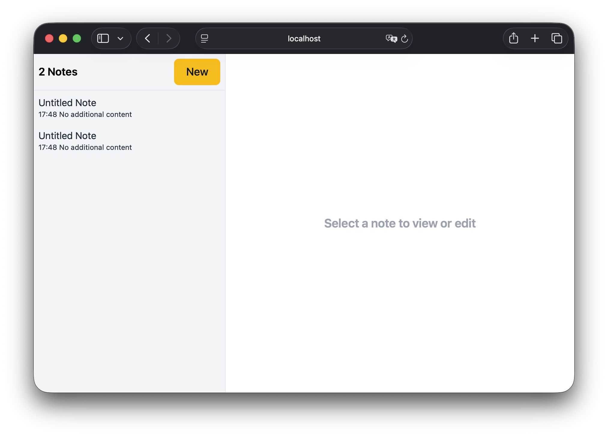

## Example Notes Component

A simple Laravel project that demonstrates how to build a notes component using Laravel's features.



The goal of this repository is not to build the best notes application. Instead, it focuses on teaching how organize a Laravel application using a component architecture, where an entire feature lives in its own directory.

### Directory Structure

```
components
└── Notes
    ├── Http
    │   └── Controllers
    │       └── NoteController.php
    ├── Models
    │   └── Note.php
    ├── NotesServiceProvider.php
    ├── database
    │   └── migrations
    │       └── 2026_07_04_183119_create_notes_table.php
    ├── resources
    │   └── views
    │       ├── partials
    │       │   ├── editor.blade.php
    │       │   └── sidebar.blade.php
    │       └── show.blade.php
    └── routes
        └── web.php
```

Everything related to the notes feature lives inside the `components/Notes` directory. This includes the controller, model, service provider, migration, views, and routes. This makes the code easier to understand, maintain, and eventually extract another project if needed.

### License

This project is open-sourced software licensed under the [MIT license](https://opensource.org/licenses/MIT).